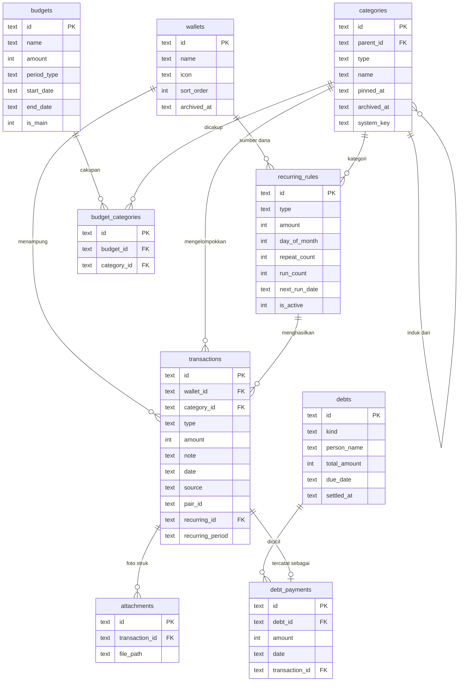

# Artamu, skema database

Pendamping untuk `artamu-schema.sql`. Simpan keduanya di repo: berkas SQL sebagai `src/db/migrations/0001_init.sql`, dokumen ini sebagai `docs/DATABASE.md`.

Skema mencakup semua fase peta rilis, dari 0.9 sampai 2.0. Rilis berikutnya menambah layar, bukan tabel.

## Diagram relasi

Semua tabel di atas juga punya `created_at`, `updated_at`, `deleted_at`, dan `synced_at`. Dua tabel lain berdiri sendiri: `settings` dan `notifications`.

## Tabel dan rilisnya

| Tabel | Isi | Mulai dipakai |
|---|---|---|
| `settings` | Bahasa, tema, jam pengingat, dompet aktif, nama panggilan | 0.9 |
| `wallets` | Dompet | 1.0, arsip di 1.4 |
| `categories` | Kategori, subkategori, dan kategori sistem | 1.0, sematan di 1.1, sub di 1.4 |
| `transactions` | Semua pergerakan uang | 0.9 |
| `recurring_rules` | Jadwal transaksi rutin | 1.2 |
| `notifications` | Daftar di layar Notifikasi | 1.2 |
| `attachments` | Foto struk | 1.4 |
| `budgets`, `budget_categories` | Anggaran dan cakupannya | 1.5 |
| `debts`, `debt_payments` | Hutang piutang dan cicilannya | 1.6 |
| kolom `synced_at` | Antrean sinkronisasi | 2.0 |

## Keputusan desain yang tertanam di skema

**Saldo tidak disimpan.** Saldo dompet adalah jumlah transaksinya, lewat tampilan `v_wallet_balances`. Saldo awal saat pertama kali buka adalah satu transaksi berkategori sistem `opening`, dan koreksi saldo adalah transaksi berkategori `adjustment`. Akibatnya saldo tidak pernah bisa berbeda dari riwayatnya.

**Kategori sistem.** Empat kategori dengan `system_key`: `transfer`, `adjustment`, `debt`, dan `opening`. Tidak tampil di pemilih kategori, dan semua query laporan serta anggaran menyaringnya dengan `system_key IS NULL`. Itulah cara transfer dan hutang tidak terhitung sebagai belanja.

**Transfer adalah dua baris** dengan `pair_id` yang sama, satu keluar di dompet asal dan satu masuk di dompet tujuan. Mengubah atau menghapus harus selalu dilakukan pada keduanya dalam satu transaksi database. Ini aturan di lapisan aplikasi.

**Subkategori lewat `parent_id`.** Transaksi boleh menunjuk ke kategori utama maupun sub. Tampilan `v_transactions` menyediakan `main_category_id`, yaitu `COALESCE(parent_id, id)`, sehingga laporan tingkat utama cukup mengelompokkan kolom itu. Pemicu menolak tingkat ketiga dan menolak sub yang jenisnya berbeda dari induknya. Sub dengan `icon` dan warna kosong mewarisi milik induknya.

**Transaksi rutin tidak bisa tercatat dobel.** Indeks unik pada `(recurring_id, recurring_period)` sengaja dibuat tanpa syarat `deleted_at`. Artinya kalau pengguna menghapus transaksi otomatis bulan Agustus, logika kejar ketertinggalan tidak akan membuatnya lagi. Pakai `INSERT OR IGNORE`.

**Anggaran lintas dompet.** Tabel `budgets` tidak punya `wallet_id`. Anggaran tanpa baris di `budget_categories` berarti mencakup semua kategori. Memilih kategori utama otomatis mencakup sub-nya, karena query mencocokkan `category_id` maupun `main_category_id`. Indeks unik menjamin hanya ada satu anggaran utama yang aktif.

**Hapus lunak di mana-mana.** Tidak ada `DELETE` di aplikasi, hanya pengisian `deleted_at`. Semua indeks yang sering dipakai bersifat parsial (`WHERE deleted_at IS NULL`) sehingga baris terhapus tidak memperlambat query. Pembersihan permanen boleh dilakukan untuk baris yang sudah terhapus lebih dari 90 hari dan sudah tersinkron.

**ID kategori bawaan dibuat tetap.** Kategori "Makan" punya ID yang sama di semua ponsel. Saat dua perangkat digabungkan di cloud, tidak muncul dua kategori Makan.

## Yang dijaga database, dan yang dijaga aplikasi

| Aturan | Dijaga oleh |
|---|---|
| Nominal harus positif, format tanggal, nilai `type` | `CHECK` |
| Jenis transaksi cocok dengan jenis kategori | Pemicu |
| Subkategori maksimal dua tingkat dan sejenis dengan induk | Pemicu |
| Nama dompet dan nama sub tidak kembar | Indeks unik |
| Hanya satu anggaran utama | Indeks unik |
| Transaksi rutin tidak dobel | Indeks unik |
| Dua sisi transfer selalu diubah bersama | Aplikasi |
| Maksimal lima kategori tersemat per jenis | Aplikasi |
| Pembayaran hutang tidak melebihi sisa | Aplikasi |
| Transfer tidak melebihi saldo asal | Aplikasi |
| `updated_at` diperbarui setiap tulis | Aplikasi, lewat satu fungsi pembungkus |

## Migrasi

- Nomor versi skema disimpan di `PRAGMA user_version`. Berkas ini adalah versi 1.
- Setiap perubahan berikutnya adalah berkas baru bernomor urut di `src/db/migrations/`, tidak pernah mengubah berkas lama.
- Saat aplikasi dibuka: baca `user_version`, jalankan semua berkas bernomor lebih besar di dalam satu transaksi, lalu naikkan nomornya. Layar "Memperbarui data" tampil selama proses ini.
- SQLite tidak bisa menghapus kolom dengan mudah, jadi biasakan hanya menambah. Kolom yang tidak dipakai lagi dibiarkan.
- Berkas cadangan JSON memuat `schema_version`. Cadangan dari versi lebih baru ditolak dengan pesan "perbarui aplikasi dulu", dan cadangan dari versi lebih lama dijalankan melewati migrasi yang sama.

## Kalau memakai Drizzle ORM

Skema yang sama bisa ditulis sebagai `src/db/schema.ts` agar tipe TypeScript diturunkan otomatis. Pemicu, tampilan, dan indeks parsial tetap ditulis sebagai SQL mentah di berkas migrasi, karena dukungan ORM untuk ketiganya terbatas. Berkas SQL ini tetap menjadi acuan.

## Sudah diuji

Skema dijalankan di SQLite 3.45 dengan data contoh. Yang diverifikasi:

- Semua tabel, indeks, pemicu, tampilan, dan data awal terbuat tanpa galat, dan pemeriksaan kunci asing bersih.
- Saldo dompet benar setelah saldo awal, gaji, belanja, dan satu transfer.
- Laporan menggulung subkategori ke induknya dan mengabaikan transfer serta hutang.
- Delapan penolakan bekerja: jenis tak cocok, sub tingkat tiga, sub beda jenis, nominal nol, format tanggal salah, nama dompet kembar, dua anggaran utama, dan transaksi rutin ganda.
- Kejar ketertinggalan tiga bulan membuat tepat tiga transaksi, dan transaksi rutin yang dihapus tidak dibuat ulang.
- Anggaran bercakupan kategori utama ikut menghitung transaksi subkategorinya.
- Sisa hutang berkurang sesuai cicilan.
- Query daftar transaksi memakai indeks `ix_tx_wallet_date`, bukan memindai seluruh tabel.
